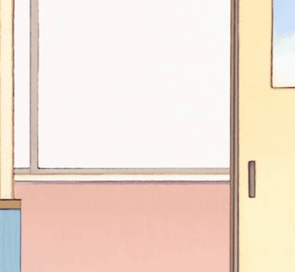

  
   
  Welcome ~ (˶˃ ᵕ ˂˶) .ᐟ.ᐟ

 

  

 

<b>About Me</b>
<ul>
  <li>Currently a student in England doing MSc Software Engineering</li>
  <li>Bass guitar player in rock bands</li>
  <li>Full-stack developer who loves building clean, functional, minimalist, and user-friendly applications</li>
  <li>Combining pixel art with code for cozy, cute, girly micro-projects ⸜(｡˃ ᵕ ˂ )⸝♡</li>
  <li>Always exploring new techies...</li>
</ul>

  

 

<b>Currently Learning:</b>
<ul>
  <li>C#/.NET</li>
  <li>Advanced TypeScript</li>
  <li>Flutter/Dart for cross-platform apps</li>
  <li>Swift/SwiftUI</li>
  <li>UI/UX Design Patterns</li>
</ul>

 

<b>Hobbies:</b>
<ul>
  <li>Gaming..*I love Terraria..</li>
  <li>Watching anime</li>
  <li>Music & productivity hacks</li>
  <li>Building side projects</li>
</ul>

---

<b>Languages & Tools</b>

  

---

<b>Featured Projects</b>
<ul>
  <li><b>[MyPortfolio](https://github.com/Haru-Tachibana/MyPortfolio)</b> – Personal portfolio website showcasing my work and skills.</li>
  <li><b>[FocusFlow](https://github.com/Haru-Tachibana/FocusFlow)</b> – Productivity app to stay focused and manage time better.</li>
  <li><b>[fridgemind](https://github.com/Haru-Tachibana/fridgemind)</b> – An app idea around managing thoughts and ideas like items in a fridge.</li>
</ul>

---

<b>GitHub Stats</b>

  

  

---

  
    <b>"Coding for fun! ૮꒰ ˶• ༝ •˶꒱ა ♡"</b>
  

