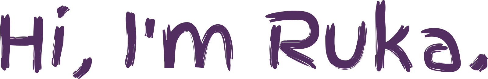

  
   
  Welcome ~ (˶˃ ᵕ ˂˶) .ᐟ.ᐟ

 

  

 

<b>About Me</b>
<ul>
  <li>Currently a student in England doing MSc Computer Science</li>
  <li>Bass guitar player in rock bands</li>
  <li>Learning electric guitar...⸜(｡˃ ᵕ ˂ )⸝♡</li>
  <li>Backend developer (upcoming)</li>
</ul>

  

 

<b>Currently Learning:</b>
<ul>
  <li>C#/.NET</li>
  <li>Java</li>
  <li>Golang</li>
  <li>Cloud computing</li>
</ul>

 

<b>Hobbies:</b>
<ul>
  <li>Gaming..*I love Terraria..</li>
  <li>Watching anime</li>
  <li>Music</li>
  <li>Sleeping</li>
</ul>

---

<b>Languages & Tools</b>

  

---

<b>GitHub Stats</b>

  

  

---

  
    <b>"Coding for fun! ૮꒰ ˶• ༝ •˶꒱ა ♡"</b>
  

