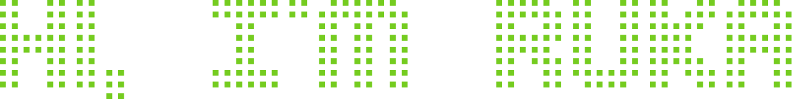

  

<b>About Me</b>
<ul>
  <li>Computer Science graduate</li>
  <li>Software & Platform engineer</li>
  <li>Bass guitar player in rock bands</li>
  <li>Learning electric guitar...⸜(｡˃ ᵕ ˂ )⸝♡</li>
</ul>

 
<b>Languages & Tools</b>

  

